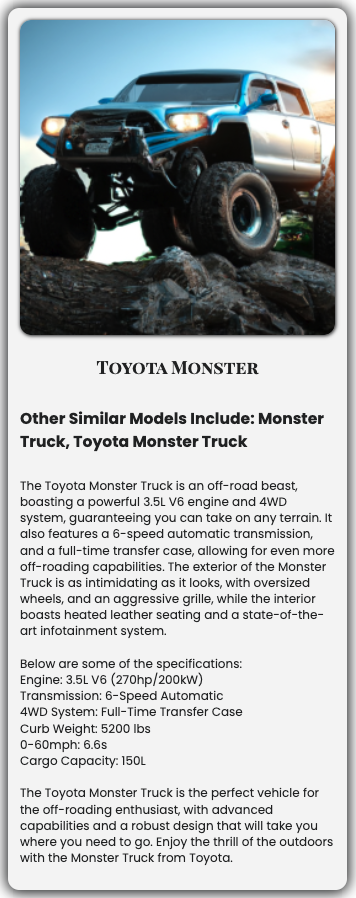

# Car Creator

AI Car Creator Bot

This is an Artifical Intelligence Bot which uses OpenAI technology and Prompt Engineering techniques to build a car with all the specifications based on a prompt. It generates an image, various models, and general specifications as you would find in an auto show brochure.

## Sample Response
Here is the interface:

Now, for example, if you entered `toyota monster truck` you would get the following car created:

